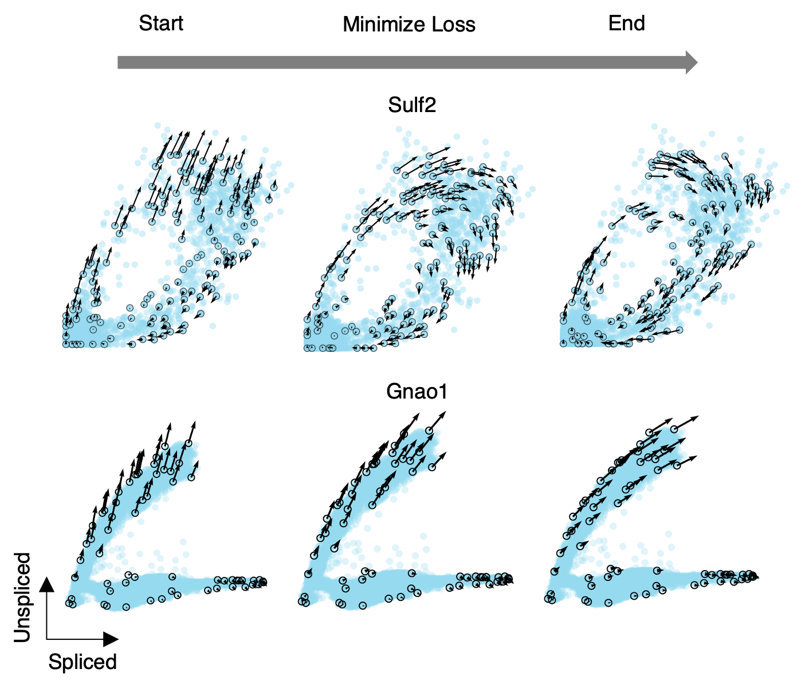
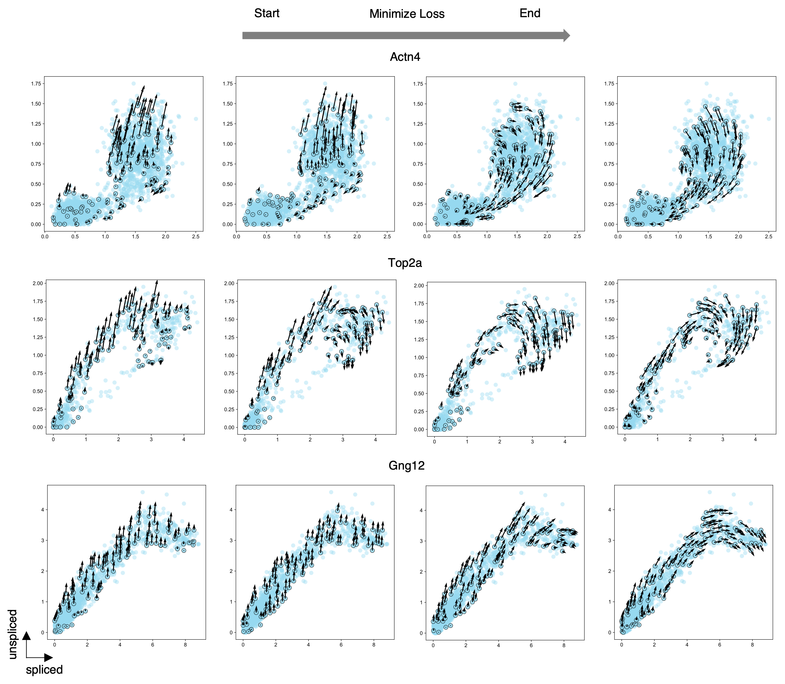

.. toolkit documentation master file, created by
   sphinx-quickstart on Wed Feb  9 17:10:01 2022.
   You can adapt this file completely to your liking, but it should at least
   contain the root `toctree` directive.

About cellDancer
===========================================================================================
The existing models of RNA velocity, velocyto and scVelo, are based on kinetics that each cell shares the rates of transcription, splicing, and degradation rates. However, our cellDancer predicts cell-specific transcription, splicing, and degradation rates which build a continuous long-time velocity. In the training of our algorithm, cellDancer minimizes a loss function, which measures the similarity between predicted and observed velocity vectors.

The next section described how does the loss decrease.

Understand the decreasing of loss
--------------------------------------
The figure of Sulf2 in the pancreatic endocrinogenesis data shows how the DNN (deep neural network) was trained step by step. During minimizing loss function, the predicted velocity of Sulf2 gradually fits to the observed spliced and unspliced mRNAs.

Below are more examples showing how the model changes during the training.

